# Описание проекта
В данном файле будет представленно справка и возможности проекта «Гамлет – что посмотреть».

## Справка проекта
### Что использовалось в проекте:
* API для поиска фильмов - kinopoisk-dev. Данная API доступна в свободном доступе для поиска фильмов и сериалов в онлайн-кинотеатре «Кинопоиск»;
* Модель искусственного интелекта - Deepseek;
* Определение тональности сообщение(Трансформер) - gliclass(классификация текста);
* Система контроля версий - Git.

### подтверждение использования системы контроля версий (Git) и удаленного репозитория (GitHub)
На рисунке ниже изображено - ветки репозитория↓
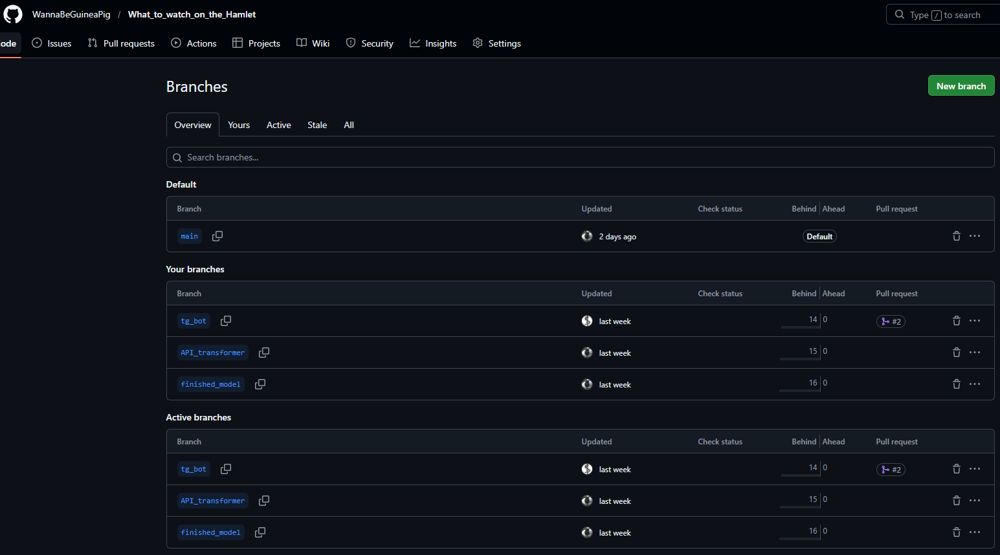
На рисунке ниже изображено - коммиты репозитория в ветке «main»↓
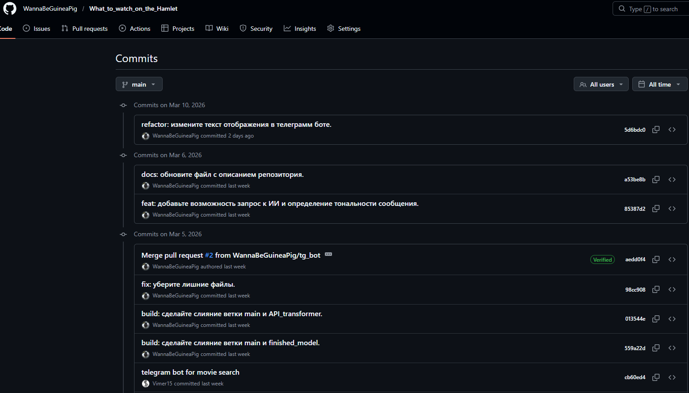
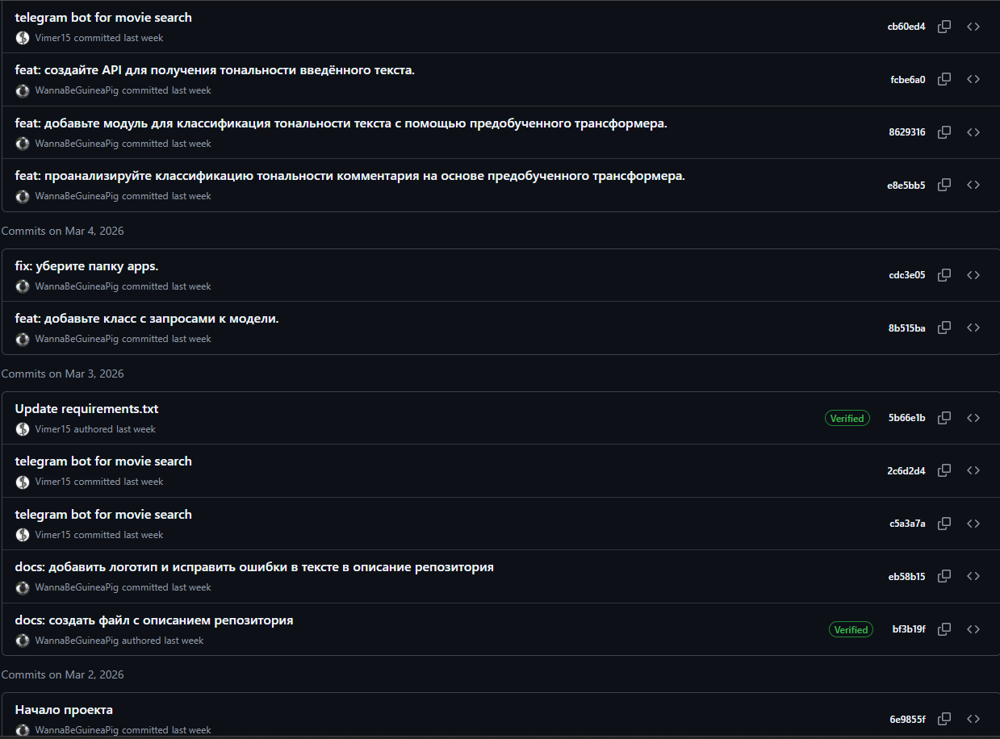
На рисунке ниже изображено - коммиты репозитория в ветке «API_transformer»↓
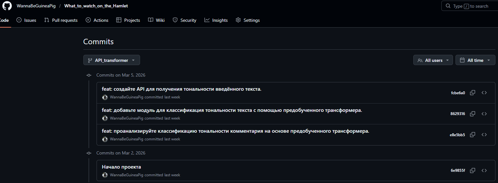
На рисунке ниже изображено - коммиты репозитория в ветке finished_model»↓
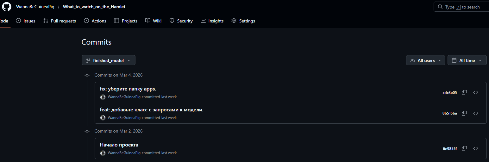
На рисунке ниже изображено - коммиты репозитория в ветке«tg_bot»↓
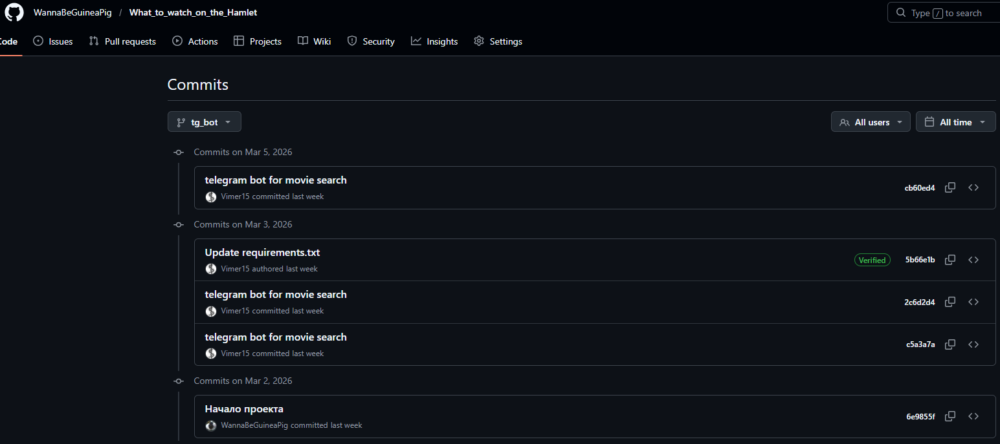

## Возможности программы
На рисунке ниже изображено - начальное окно↓
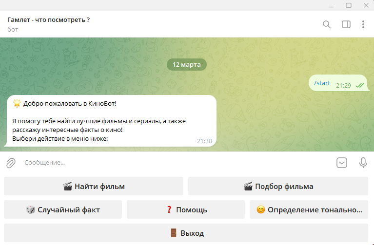

На рисунке ниже изображено - Справка по командам↓
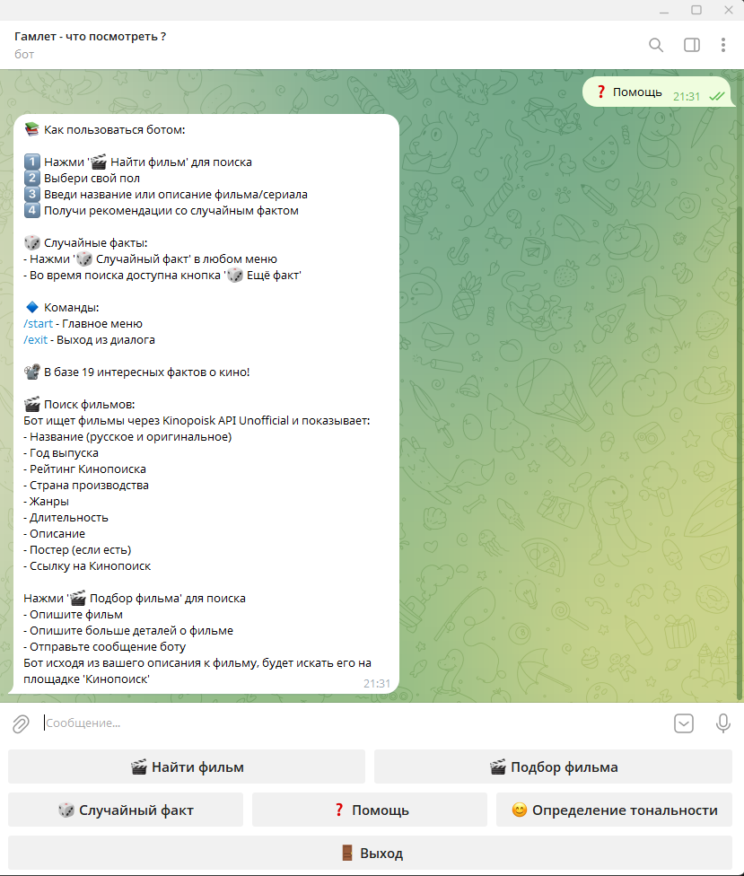

На рисунке ниже изображено - случайный факт об киноиндустрии↓
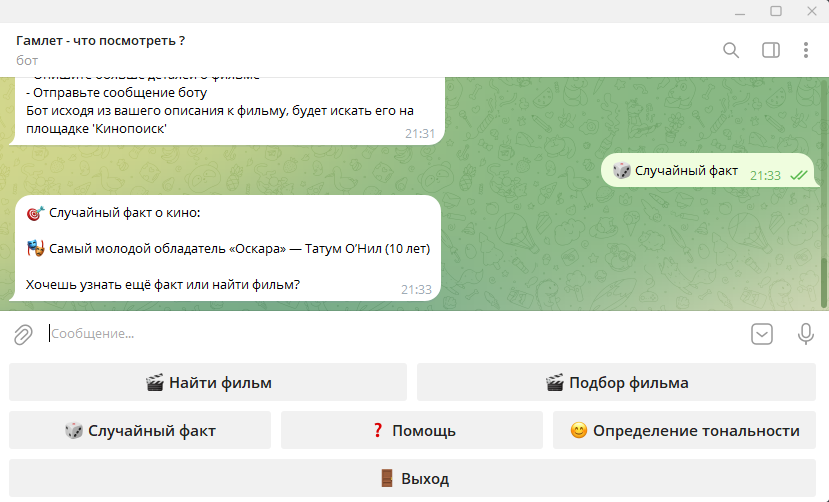

На рисунке ниже изображено - определение тональности сообщения↓
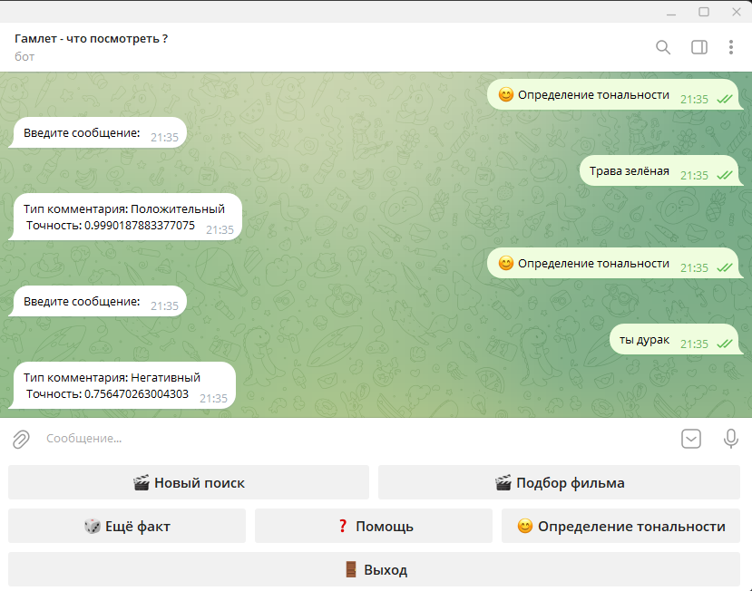

На рисунке ниже изображено - подбор фильма по предпочтениям↓
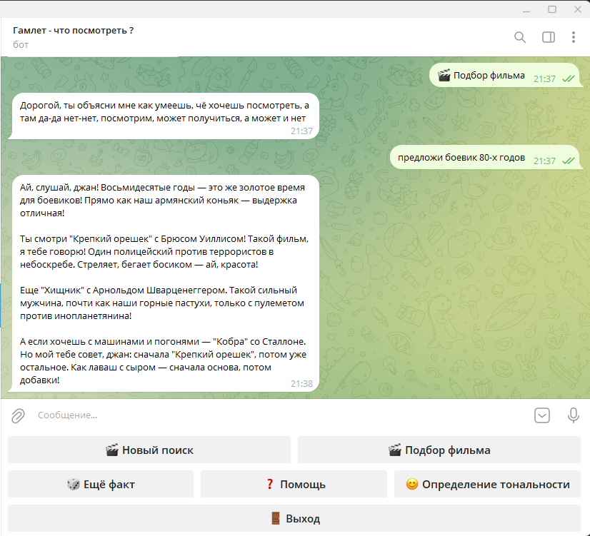

На рисунке ниже изображено - подбор фильма по кинопоиску↓
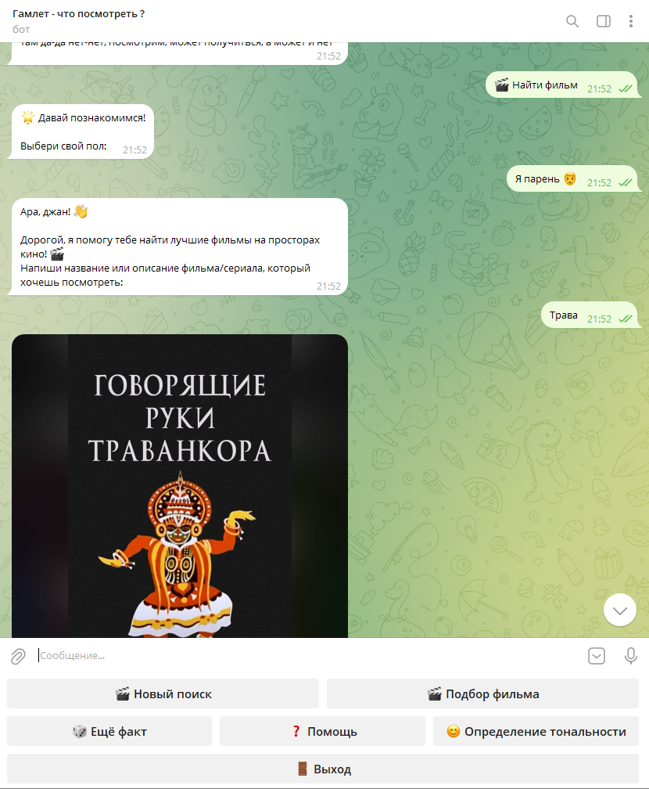

## Описание коммитов
| Название | Описание                                                        |
|----------|-----------------------------------------------------------------|
| build	   | Сборка проекта или изменения внешних зависимостей               |
| ci       | Настройка CI и работа со скриптами                              |
| sec      | Безопасность, уязвимости                                        |
| docs	   | Обновление документации                                         |
| feat	   | Добавление нового функционала                                   |
| fix	   | Исправление ошибок                                              |
| perf	   | Изменения направленные на улучшение производительности          |
| refactor | Правки кода без исправления ошибок или добавления новых функций |
| revert   | Откат на предыдущие коммиты                                     |
| style	   | Правки по кодстайлу (табы, отступы, точки, запятые и т.д.)      |
| test	   | Добавление тестов                                               |
